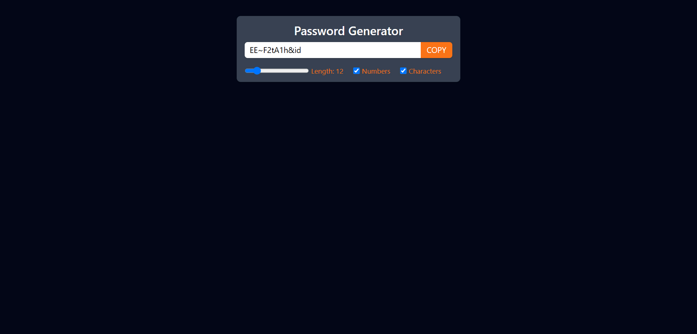

# Password Generator
Hi, this repository contains a Password Generator web app built with ReactJS. The app enables users to generate random passwords with lengths ranging from 8 to 35 characters and includes options to add numbers and special characters for enhanced security. This project leverages various React hooks to manage states, effects, and optimizations.

Built with:

  

## Output:

